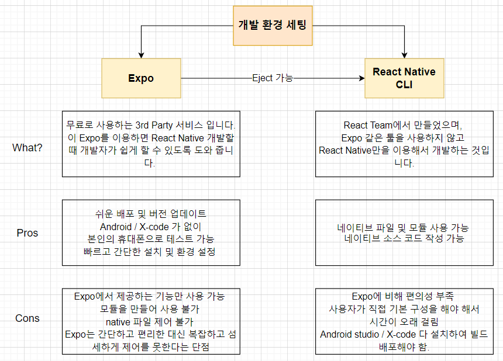

## React Native란?

<aside>

React와 앱 플랫폼의 기본 기능을 사용하여 Android 및 iOS 애플리케이션을 빌드하기 위한 오픈 소스 프레임워크

</aside>

- 장점
  - WebView를 사용하는 다른 크로스 플랫폼(Cordova, Ionic 등)과는 다르게 실제 호스트 플랫폼의 표준 렌더링 API를 사용해서 렌더링
    ⇒ WebView를 사용하면 성능상의 문제와 Native에서 사용하는 기본 UI 요소나 애니메이션을 Javascript, HTML 및 CSS 조합으로 모방하려고 하기에 한계가 있다.
    ⇒ React Native는 마크업 요소를 실제 네이티브 요소로 변환해서 사용한다.
  - 작성하는 대부분의 코드를 플랫폼 간에 공유할 수 있기 때문에 비슷한 소스 코드로 iOS와 Android 모두를 위한 앱 개발을 할 수 있어 시간과 비용의 절약이 가능하다.
- Native Components

  
  

  - Android 개발에서는 Kotlin 또는 Java로, iOS 개발에서는 Swift 또는 Objective-C로 View를 작성
  - React Native를 사용하면 React Component를 사용하여 JavaScript로 이러한 View를 호출할 수 있음
  - 런타임 시 React Native는 해당 구성 요소에 해당하는 Android 및 iOS View를 생성하는데, **다른 앱과 같은 모양, 느낌 및 성능을 제공하는 플랫폼 지원 구성 요소를 Native Components라고 한다.**

- Core Components
  - 리액트에서 기본 제공하는 Native Components
     

## React Native 개발 환경

<aside>

React Native를 이용할 때 개발 환경을 세팅하는 방법은 대표적으로 **Expo**와 **React Native CLI** 두가지가 있다.

</aside>

