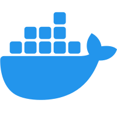
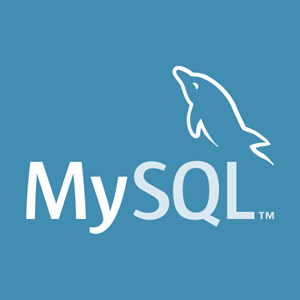

# 📸 MOA


<br><br>

## 🔍 프로젝트 개요

### 🔶 주제
**사진 공유 및 AI 자동 분류 서비스**
<br>
쉽고 빠르게 사진을 공유하고 내가 원하는 사진만 분류하여 다운받을 수 있는 서비스

<br>

### 🔶 기간
**2024.10.14 ~ 2024.11.21**

<br>

### 🔶 팀원 소개
| 문선정 | 김윤홍 | 김주형 | 민예림 | 임세하 |
|:------:|:------:|:------:|:------:|:------:|
|  |  |  |  | |
| 팀장 / FE | BE | 인프라, BE | AI, BE | FE
| [GitHub](https://github.com/ssafigpotato) | [GitHub](https://github.com/chelsea7023) | [GitHub](https://github.com/j00boy) | [GitHub](https://github.com/yelim99) | [GitHub](https://github.com/sehaim) |

<br><br>

## 📢 서비스 소개

### 🔶 주요 기능
- **사진 공유**
    - 순간과 그룹<br>
    **순간**: 워크샵, 마라톤 등 일회적인 만남을 위한 공간 / 공간 자체가 **24시간**의 유효시간을 가짐.<br>
    **그룹**: 정기적인 모임을 위한 공간 / **공간은 유지**, 공유되는 사진은 마찬가지로 **24시간**의 유효시간을 가짐

- **사진 분류**
    - **인물 사진 분류**<br>
    공유된 사진들 속에서 얼굴을 검출하여, 마이페이지에 등록된 얼굴과 비교하여 동일한 얼굴이 포함된 사진만 분류
    - **음식 사진 분류**<br>
    공유된 사진들 속에서 음식 사진만 분류

- **사진 다운로드**
    - 분류된 사진을 내 로컬 저장소로 다운로드

<br>

### 🔶 화면

| 그룹 | 순간 |
|:------:|:------:|
| |

<br>

| 얼굴 등록 | 사진 업로드 |
|:------:|:------:|
| |

<br>

| 인물 사진 분류 | 음식 사진 분류 |
|:------:|:------:|
| |

<br><br>

## 🛠️ 기술 소개

### 🔶 얼굴 사진 등록 (AI)
<br>
- **OpenCV의 face_recognition 라이브러리** 활용하여 얼굴 임베딩 값을 추출한 후 DB에 저장

<br>

### 🔶 분류 및 다운로드 (AI)
<br>
- **인물 사진 분류**<br>
공유된 사진들에서 얼굴 검출 후 각 얼굴의 임베딩 값을 저장된 임베딩 값과 비교하여 동일 얼굴 분류
- **음식 사진 분류**<br>
공유된 사진들에서 음식 사진 데이터셋으로 파인튜닝한 **YOLOv8 모델**을 활용하여 **음식이 포함된 사진**을 1차적으로 분류<br>
분류된 사진들에서 얼굴 사진 데이터셋으로 파인튜닝한 **YOLOv8 모델**을 활용하여 얼굴이 있는 사진은 제외하여 **음식만 있는 사진**을 최종 분류

<br>

### 🔶 시스템 아키텍쳐 (BE)
<br>
- **DB**<br>
    - **MySQL**<br>
    유저와 그룹의 복잡한 관계를 강력한 조인으로 효과적으로 관리
    - **mongoDB**<br>
    주기적인 삭제와 빈번한 쓰기가 일어나는 '순간'을 효율적으로 관리
    - **Redis**<br>
    유저와 순간을 중개하는 테이블로, 동적인 환경에서 실시간 세션 관리
- **Server**<br>
    - **EC2**<br>
    기본 서비스 로직을 위한 서버
    - **EC2**<br>
    AI 모델을 보다 더 빠르게 하고, 독립적인 관리를 위한 GPU 서버
    - **S3**<br>
    이미지를 저장하는 스토리지

<br>

### 🔶 초대 및 공유 (FE)
<br>

- **딥링크와 앱링크**<br>
딥링크와 앱링크를 모두 사용하여 플랫폼에 관계없이 앱 내의 특정 콘텐츠에 빠르게 접근 가능

<br><br>

## ⚙️ 개발 환경 및 기술 스택

### Server
|  |  |  |
|-----------------|-----------------|-----------------|
| Ubuntu |   | 20.04.6 LTS |
| Nginx |  | 1.18.0 |

### CI/CD
|  |  |  |
|-----------------|-----------------|-----------------|
| Docker |  | 27.3.1 |
| Docker-compose |  | 2.20.0 |
| Jenkins |  |  |
| SonarQube |  |  |

<br>

### Frotend
|  |  |  |
|-----------------|-----------------|-----------------|
| React-native    |   |  |
| Typescript    |  |  |

<br>

### Backend
|  |  |  |
|-----------------|-----------------|-----------------|
| SpringBoot |      |  |
| MySQL |      | 9.1.0 |
| Redis |      | 7.2.4 |
| mongoDB |      |  |

<br>

### AI
|  |  |  |
|-----------------|-----------------|-----------------|
| Python |      | 3.8 |
| FastAPI |      |  |


<br>

### Cooperation
|  |  |
|-----------------|-----------------|
| Git    |      |
| GitLab    |      |
| Jira    |      |
| Notion    |      |

<br><br>

## ✏️ 커밋 컨벤션

### 기본 구조
```
이모지[type] 기능설명

body 
```

<br>

### type 종류
```
Feat : 새로운 기능 추가
Fix : 버그 수정
Docs : 문서 수정
Style : 코드 포맷팅, 세미콜론 누락, 코드 변경이 없는 경우
Refactor : 코드 리펙토링
Test : 테스트 코드, 리펙토링 테스트 코드 추가
Chore : 패키지 매니저 수정, 그 외 기타 수정
Design: CSS 등 사용자 UI 디자인 변경
Comment: 필요한 주석 추가 및 변경
Rename: 파일 또는 폴더 명을 수정하거나 옮기는 작업만 수행한 경우
Remove: 파일을 삭제하는 작업만 수행한 경우
!HOTFIX: 급하게 치명적인 버그를 고치는 경우
```

<br>

### 커밋 이모지
```
✨  :sparkles:  코드 작성
♻️  :recycle:   코드의 구조/형태 개선
📝  :memo:      문서 추가/수정
🐛  :bug:       버그 수정
🚑  :ambulance: 긴급 수정
🎨  :art:       UI/스타일 파일 추가/수정
🔧  :wrench:    구성 파일 추가/삭제
🎉  :tada:      프로젝트 시작
```

<br>

### 커밋 예시
```
== ex1
✨[Feat] 얼굴 등록 구현

== ex2
🚑[!HOTFIX] Jenkins 수정
```